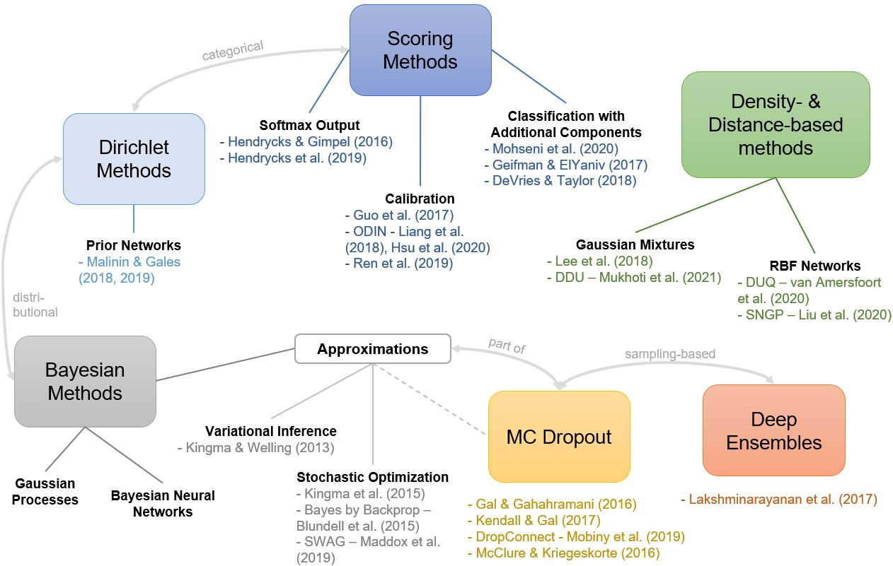

# Uncertainty Estimation on Deep Learning Models for Out-of-Distribution Detection
## Introduction

This repository contains tools and scripts to:
- train an uncertainty-aware deep classifier on custom image data
- evaluate the classification and OOD detection performance of the respective model using:
    - Histogram plots of uncertainty metrics from ID and OOD data
    - ROC curves and AUROC
    - Calibration plots and ECE
    - Accuracy-rejection curves
- compare the performances of different UE-methods in an integrative manner

Implementations of state-of-the-art UE-methods include:
- DeepEnsembles (Lakshminarayanan et al. 2017, https://arxiv.org/abs/1612.01474)
- MCDropout (Gal and Ghahramani 2016, https://arxiv.org/abs/1506.02142)
- BayesbyBackprop (Blundell et al. 2015, https://arxiv.org/abs/1505.05424)
- Mahalanobis (Lee et al. 2018, https://arxiv.org/abs/1807.03888)
- Deterministic Uncertainty Quantification - DUQ (van Amersfoort et al. 2020, https://arxiv.org/abs/2003.02037)
- LearningConfidence (de Vries and Taylor 2017, https://arxiv.org/abs/1802.04865)



## Data Preparation
All methods are available for application on toy datasets like MNIST or CIFAR-10, but when applying them to custom (real) image data, the input needs to be provided in a separate directory next to the head repository folder. It is expected to be structured into separate training, validation, test and OOD folders each sorted by classes, where the OOD set only contains one "not_class" (since no actual class assignments are available):

| ***Your Use Case Data*** \
    &emsp; |_ _train_ \
        &emsp; &emsp; |_ _class 1_ \
        &emsp; &emsp; |_ _class 2_ \
        &emsp; &emsp; |_ ... \
    &emsp; |_ _val_ \
        &emsp; &emsp; |_ _class 1_ \
        &emsp; &emsp; |_ _class 2_ \
        &emsp; &emsp; |_ ... \
    &emsp; |_ _test_ \
        &emsp; &emsp; |_ _class 1_ \
        &emsp; &emsp; |_ _class 2_ \
        &emsp; &emsp; |_ ... \
    &emsp; |_ _ood_ \
        &emsp; &emsp; |_ _not_class_

In this repositiory, two custom use case datasets are considered: the RR Element dataset and the Emblem dataset. For other, individual datasets, the respective names need to be adapted in the training and evaluation scripts and a custom dataloader needs to be created and included.

## Training
All implemented UE-methods come with a script for model or backbone training that takes in a range of parameters that are detailed in the respective subfolders.

## Evaluation
All implemented UE-methods (with the exception of Mahalanobis) come with a script for the evaluation of the UE-method in terms of classification and OOD detection. Several metrics and graphs are calculated on the ID test and OOD set, evaluated, visualized and stored. The script also takes a set of parameters that are detailed in the respective subfolders. \
_Note: for Mahalanobis, the script split is different (train -> generate -> regress), see the Mahalanobis subfolder for details._

## Comparison
The subdirectory **Integration** contains a script for the creation of comparative graphs including all results obtained from the above UE-methods. \
_Prerequisite:_ Before running ```compare_plots.py```, the best results of the individual methods need to be stored. This is achieved by setting the ```--final_model``` flag during the execution of the evaluation script (or regression script for Mahalanobis, respectively). The stored .npy-resultfiles need to be referenced for script execution from within the _Integration_ folder like in the following example:
```
python compare_plots.py --gpu 0 --dataset Emblem --backbone best \
            --plot_path curves \
            --ENS_file DeepEnsembles/vgg16_entropy_Emblemusecase_12.npz \
            --MCDO_file MCDropout/resnet34_entropy_Emblemusecase_51.npz \
            --BBB_file BBB/Gaussian_prior_entropy_Emblemusecase_10.npz \
            --MAHAL_file Mahalanobis/vgg16_Emblemusecase_13.npz \
            --DUQ_file DUQ/resnet34_Emblem_5.npz \
            --LC_file LearningConfidence/linear_confidence_Emblemusecase_14.npz \
            --SM_file DeepEnsembles/1_vgg16_entropy_Emblemusecase_12.npz
```
where the respective npz-filename tags reference the UE algorithms as follows:
- ```--ENS_file```: Deep Ensembles
- ```--MCDO_file```: MC Dropout
- ```--BBB_file```: Bayes by Backprop
- ```--MAHAL_file```: Mahalanobis
- ```--DUQ_file```: DUQ
- ```--LC_file```: Learning Confidence
- ```--SM_file```: Simple Softmax model (as computed using a 1-member Ensemble)